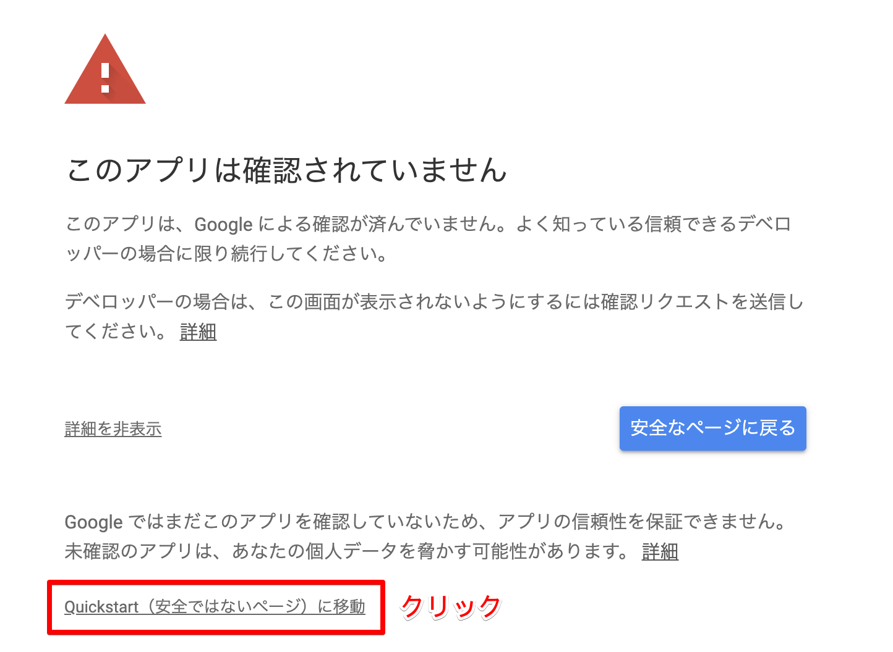
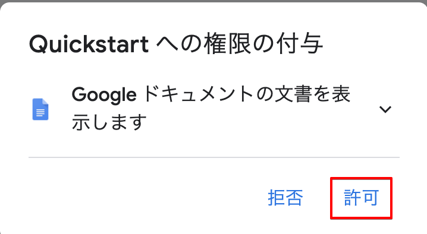
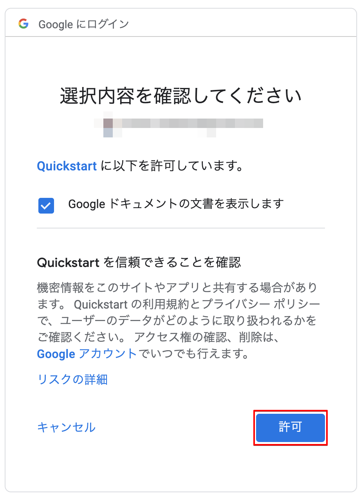
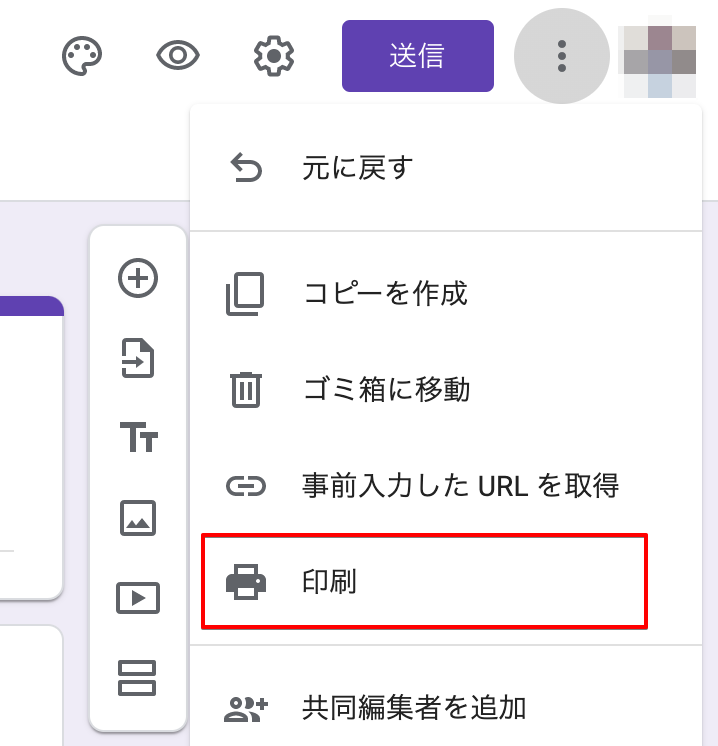

# japanese-word-counter

GitHub Repository、Google Docs、Google Slides、Google Forms 内の日本語の文字数をカウントする Python スクリプト群です。

これらのスクリプトは、**ひらがな、カタカナ、漢字**のみをカウントします。英数字、半角文字、句読点や記号などはカウントされません。

いずれのスクリプトも、計算結果を TSV 形式で標準出力します（以下の通り）。

```
React JP	2047	コンポーネント指向...	https://docs.google.com/document/d/XXX
Redux JP	3282	状態管理を行うのに...	https://docs.google.com/document/d/YYY
Lerna JP	1092	モノレポ環境を構築...	https://docs.google.com/document/d/ZZZ
```

## Requirements

**python2 では実行できないので、注意！**

- python3

## GitHub Repository 内のファイル

調べたいレポジトリをクローンしたディレクトリがおいてあるディレクトリ直下に、`JPWordChecker4Repo.py` を配置してください（以下の通り）。

```
root/
　├ xxx-repo/
　├ yyy-repo/
　├ zzz-repo/
　│
　└ JPWordChecker4Repo.py
```

このスクリプトは、直下のディレクトリを再帰的に検索し、キーワードと一致するファイルについて、日本語の文字数をカウントします。

使用する前に、`JPWordChecker4Repo.py` ファイルを開き、Line32-33 を以下の通りに書き換えます。

- `TARGET_FILE_EXTENSION`: ファイルの拡張子など、検索キーワードを記載（正規表現も使用可能）。
- `GITHUB_ORGANIZATION_URL`: 対象の Organization の GitHub URL を記載。

```py
TARGET_FILE_EXTENSION = "ja.md"
GITHUB_ORGANIZATION_URL = "https://github.com/codechrysalis/"
```

設定が終わったら、以下のコマンドを実行します。

```zsh
python3 JPWordChecker4Repo.py > Repo_count.tsv
```

`Repo_count.tsv` ファイルの中身を Excel やスプレットシートなどにコピペして、リストとして見ることもできます。

## Google Slides

1. [Google Slides API - Quick Start](https://developers.google.com/slides/quickstart/python) のページに移動する。
2. ページ内の `Enable the Google Slides API` ボタンをクリックし、自分のアカウントの認証情報を取得する。`JPWordChecker4GSlides.py` ファイルと同じディレクトリに、`credentials_slides.json` という名前で credential ファイルを保存する。
3. `JPWordChecker4GSlides.py` ファイルの Line18-20 のリストに、解析対象の Presentation ID とタイトル（任意のもので OK）を書き込む（`https://docs.google.com/presentation/d/xxx/edit` の「**xxx**」が Presentation ID になります）。

```py
# ["Presentation ID", "Slide Title"]
PRESENTATION_ID_LIST = [
    ['PRESENTATION_ID_XXX', 'React JP'],
    ['PRESENTATION_ID_YYY', 'Redux JP'],
    ['PRESENTATION_ID_ZZZ', 'Lerna JP']
]
```

4. 以下のコマンドを実行。

```zsh
# 必要なライブラリをインストール
sudo pip3 install google-api-python-client google-auth-httplib2 google-auth-oauthlib

# スクリプトの実行
python3 JPWordChecker4GSlides.py > Slides_count.tsv
```

5. 初回のみ、Web ブラウザが開き、認証を求めてくるのでアクセスを許可する。`詳細を表示`をクリックし、`Quickstart（安全ではないページ）に移動`をクリックする。後は指示通りに、許可をクリックする（この処理により、OAuth 認証用のトークンが発行され、ディレクトリに tokenSlides.pickle が生成される）。







1. `testS_count.tsv` ファイルの中身を Excel やスプレットシートなどにコピペして、リストとして見ることもできる。

## Google Docs

1. [Google Docs API - Quick Start](https://developers.google.com/docs/api/quickstart/python) のページに移動する。
2. ページ内の `Enable the Google Docs API` ボタンをクリックし、自分のアカウントの認証情報を取得する。`JPWordChecker4GDocs.py` ファイルと同じディレクトリに、`credentials_docs.json` という名前で credential ファイルを保存する。
3. `JPWordChecker4GDocs.py` ファイルの Line18-20 のリストに、解析対象の Document ID とタイトル（任意のもので OK）を書き込む（`https://docs.google.com/document/d/xxx/edit` の「**xxx**」が Document ID になります）。

```py
# ["Document ID", "Docs Title"]
DOCS_ID_LIST = [
    ['DOCUMENT_ID_XXX', 'React JP'],
    ['DOCUMENT_ID_YYY', 'Redux JP'],
    ['DOCUMENT_ID_ZZZ', 'Lerna JP']
]
```

4. 以下のコマンドを実行。

```zsh
# 必要なライブラリをインストール（インストール済みの場合は、不要）
sudo pip3 install google-api-python-client google-auth-httplib2 google-auth-oauthlib

# スクリプトの実行
python3 JPWordChecker4GDocs.py > Docs_count.tsv
```

5. 初回のみ、Web ブラウザが開き、認証を求めてくるのでアクセスを許可する。`詳細を表示`をクリックし、`Quickstart（安全ではないページ）に移動`をクリックする。後は指示通りに、許可をクリックする（この処理により、OAuth 認証用のトークンが発行され、ディレクトリに tokenDocs.pickle が生成される）。

6. `Docs_count.tsv` ファイルの中身を Excel やスプレットシートなどにコピペして、リストとして見ることもできる。

## Google Forms

1. 解析対象の Google Forms の PDF ファイルをダウンロードする（Google Forms の `印刷` から PDF としてダウンロードできます。また、ファイルは `pdf/` ディレクトリに保存すること）。



2. `JPWordChecker4PDF.py` ファイルの Line16-22 のリストに、解析対象の Google Forms の ID とダウンロードした PDF ファイル名を書き込む（`https://docs.google.com/forms/d/xxx/edit` の「**xxx**」が Forms ID になります）。

```py
input_path_list = [["FORMS_ID_XXX", 'React JP - Google フォーム.pdf'],
                   ["FORMS_ID_YYY", 'Redux JP - Google フォーム.pdf'],
                   ["FORMS_ID_ZZZ", 'Lerna JP - Google フォーム.pdf']
                  ]
```

3. 以下のコマンドを実行。

```zsh
# 必要なライブラリをインストール
pip3 install pdfminer.six

# スクリプトの実行
python3 JPWordChecker4PDF.py > Forms_count.tsv
```

4. `Forms_count.tsv` ファイルの中身を Excel やスプレットシートなどにコピペして、リストとして見ることもできる。
